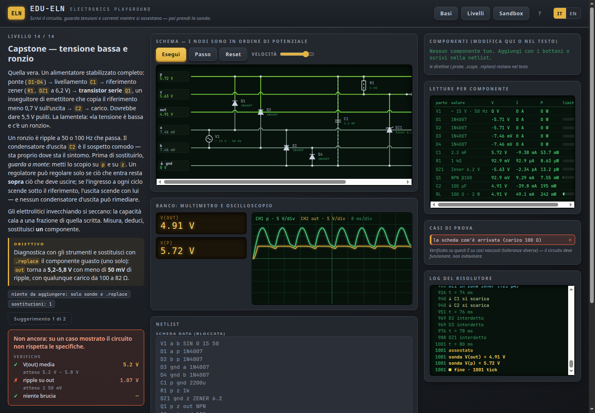

# EDU-ELN · Electronics Playground

[🇮🇹 Italiano](README.md) · 🇬🇧 English

**▶ Try it online: <https://manzolo.github.io/ElectronicsSimulator/?lang=en>**

An interactive lab to understand **analog electronics by watching it work**.
You write a circuit as a netlist (one line per part); a hand-written solver —
modified nodal analysis + Newton-Raphson, no libraries, no SPICE — computes
voltages and currents and **shows** them: nodes become horizontal rails
ordered by potential (higher up, more volts), wires take the colour of their
voltage, currents march along the parts, an LED glows in proportion to its
current. On the bench sit a **multimeter** and a **two-channel oscilloscope**.
And the limits are real: a ¼ W resistor with 0.3 W on it **burns**, goes open,
and the circuit changes.



It is the ground floor of the EDU-\* series — the one that goes *from the
transistor to the web* and which, before this lab, started at the logic gates:
below [EDU-NUM](https://github.com/manzolo/NumberSimulator) and
[EDU-16](https://github.com/manzolo/AssemblerSimulator) there was nothing. The
other siblings: [EDU-SQL](https://github.com/manzolo/SqlSimulator),
[EDU-NET](https://github.com/manzolo/NetworkSimulator),
[EDU-REGEX](https://github.com/manzolo/RegexSimulator),
[EDU-NN](https://github.com/manzolo/NeuralSimulator),
[EDU-OS](https://github.com/manzolo/OsSimulator),
[EDU-ALGO](https://github.com/manzolo/AlgoSimulator),
[EDU-CRYPTO](https://github.com/manzolo/CryptoSimulator),
[EDU-GIT](https://github.com/manzolo/GitSimulator) and
[EDU-BRANCH](https://github.com/manzolo/GitBranchingSimulator).

## An honest note

I **put this lab together with AI** (Claude Code), in one evening, **to learn the subject
myself**: the solver, the device models, the levels and these very words were written by the AI
on my directions, and **I am not in a position to guarantee that everything is correct**. The
tests compare the engine with the textbook formulas (divider, 1/e, −3 dB, ripple ≈ I/(2f·C),
I<sub>c</sub> = β·I<sub>b</sub>) and they pass — but a test written by the same hand that wrote
the code is not a review. If you find a value that looks wrong, a model that is too simplified
or an explanation that is off, **[open an
issue](https://github.com/manzolo/ElectronicsSimulator/issues/new)**: that is exactly how this
lab can become right. On the site, the "Report a problem" link prefills level, language and
engine state for you.

There is an independent check, though, and you can repeat it. The **"Second opinion on
Falstad"** button exports the current circuit to Paul Falstad's
[CircuitJS1](https://www.falstad.com/circuit/) — another simulator, by another author, with
another engine — and opens it there (`tools/xcheck-falstad.mjs` does the same in headless Chrome
for the DC levels). The result, as of 2026-09-05:

| Level | Node | EDU-ELN | CircuitJS | Δ |
|---|---|---|---|---|
| divider | out | 3.3364 V | 3.3364 V | 0.0 mV |
| loaded divider | out | 3.3962 V | 3.3962 V | 0.0 mV |
| Wheatstone | a / b | 6.1783 / 6.1650 V | 6.1783 / 6.1650 V | 0.0 mV |
| LED | out | 1.997 V | 1.882 V | 115 mV |
| Zener | out | 5.113 V | 5.130 V | 17 mV |
| saturated BJT | c | 0.1015 V | 0.1005 V | 1.0 mV |
| saturated BJT | b | 0.780 V | 0.720 V | 59 mV |

On **linear** circuits the two solvers agree to a tenth of a millivolt: the engine does the
arithmetic right. On **semiconductors** they differ by a few tens of millivolts, as expected:
the *models* are different (our LED reads 2.0 V at 15 mA, Falstad's 1.9; threshold voltages
and saturation currents are not the same) — like two diodes of different brands on the bench.
This does not say the models are "right"; it says the solver is.

## Why a hand-written engine

This is the only lab in the series with a **continuous** rather than symbolic
model: correctness lives in the solver, not in a transition table. Which is
exactly why it has to be hand-written — so every number you see comes out of
an equation you can read:

- **MNA** (`js/core/solver.js`): every part "stamps" its conductance and
  equivalent source into the matrix; a resistor is a conductance, capacitors
  and inductors in a transient become their *companion model* (backward
  Euler), voltage sources add a current unknown.
- **Newton-Raphson**: diodes, Zeners and transistors (Ebers-Moll) are
  linearized around the current guess and iterated until the guess stops
  moving; junction voltages are limited between iterations (`pnjlim`, as in
  SPICE) so an exponential cannot run away.
- **The tick**: at the operating point every tick is **one Newton iteration**
  (you watch the solver converge); in the transient every tick is **one time
  step**. Same protocol as the siblings
  (`nextTime`/`stepOnce`/`advanceTo`/`finalState`), same Player.
- **Limits**: resistor power rating, diode maximum current, Zener and
  transistor power. Exceed them → a `burn` event, the part goes open, the same
  instant is solved again. In transients the stress is averaged (thermal
  inertia): a few milliseconds of inrush do not kill a rectifier, a steady
  overload does.
- **Deterministic**: no `Math.random`, no `Date.now`. Same netlist, same
  numbers, always.

The model is deliberately small and didactic — a Shockley diode, a Zener with
its knee at V<sub>z</sub>, an NPN with β — but the numbers are the real ones:
the LED reads 2.0 V at 15 mA, silicon 0.71 V at 10 mA, the RC filter is −3 dB
where the formula says.

## The netlist

```
V1 in gnd DC 9              R1 in out 4.7k [0.5W]      C1 out gnd 100n
V1 in gnd SIN 0 5 1k        L1 a b 10m                 D1 a k [SI|1N4007|LED|SCHOTTKY]
V1 in gnd PULSE 0 3.3 1k    Q1 c b e NPN [beta]        DZ1 a k ZENER 5.1
V1 in gnd STEP 5 0 0        .tran 20m [dt]             .probe out · .probe I(R1)
.scope in out               .replace C1                # comment
```

Suffixes `p n u m k M` (one deliberate choice: `m` is milli and `M` is mega,
unlike SPICE). Errors are positioned on the token, as in EDU-SQL's editor.

## Curriculum

**No prerequisites**: on the first visit a primer ("Basics") opens and
explains from zero voltage, current and resistance with the water analogy, why
"higher is more volts", the parts you will meet, how a netlist is written and
how an instrument is read, plus a glossary. It stays one click away.

14 levels + a sandbox, in three arcs:

1. **Parts and laws** — Ohm's law (and power) · series/parallel and the
   divider, with the E12 series · the divider *under load* (Thévenin) · the
   LED and its ballast resistor — the too-small one burns · Kirchhoff and the
   Wheatstone bridge to balance.
2. **Time and signals** — the capacitor and the time constant · the
   oscilloscope (V<sub>pp</sub>, offset, frequency) · the RC low-pass at −3 dB
   · the diode and the half-wave rectifier · the Graetz bridge and ripple ·
   the Zener as a reference · the transistor as a switch (saturation, a β
   that wobbles, the GPIO limit).
3. **The bench** — the two levels no other simulator has: a board that *does
   not work*, the schematic locked, and a probe. **13**: the supply is dead —
   follow the signal until it disappears. **14**: low voltage and a hum — the
   symptom is at the output, the cause two stages upstream. Measure, deduce,
   `.replace` **one** part.

Every level hands you a board (locked) and asks you to add or replace
something; verification **measures** the circuit on several cases — some
shown, some **hidden with different tolerances** (the battery at 9.2 V, the
load at 390 Ω instead of 470, a transistor with β = 60) — so a design that
holds passes and a lucky shot does not. There is no single "right answer":
330 µF passes the visible case and fails the heavy load, 470 µF holds both.

## Run

Pure static site, ES modules, **zero build, zero dependencies**. Serve the
folder with any static server (ES modules do not work over `file://`):

```
npm run serve        # python3 -m http.server 8000
# open http://localhost:8000
```

Deploys to GitHub Pages from `main`/root as-is (`.nojekyll`, relative paths).

## Development / tests

```
npm test                       # node --test — units, parser, solver physics, all 14 levels, anti-cheat, Falstad export
npm run e2e                    # headless Chrome smoke test: primer, level 1, the LED that burns, repairing the capstone, language switch
node tools/xcheck-falstad.mjs  # cross-check of the DC levels against CircuitJS1 on falstad.com (needs network)
```

The core (`js/core/`) is fully DOM-free and deterministic, hence testable
headless: the same engine animates the circuit and grades your answer. The
physics tests compare the solver with the formulas (divider, 1/e, −3 dB,
ripple ≈ I/(2f·C), I<sub>c</sub> = β·I<sub>b</sub>).

## License

MIT © Andrea Manzi (manzolo)
